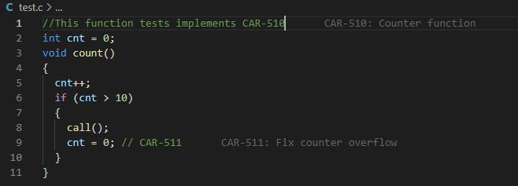

# vscode-polarion README

This extension finds work items in polarion and add the title of the work item behind the item ID in any text. These texts are decorations in Code and do not interfere with the document itself.

## Features

After setup after any save expect the titles to be displayed like depicted below:

## Requirements

## Extension Settings

Include if your extension adds any VS Code settings through the `contributes.configuration` extension point.

For example:

This extension contributes the following settings:

* `Polarion.Username`: The polarion username to log in
* `Polarion.Password`: The password for that user
* `Polarion.Url`: The polarion url, f.e.: http://polarion2020.example.com/polarion
* `Polarion.Project`: The polarion project ID
* `Polarion.Prefix`: The ticket prefix without the -
* `Polarion.Color`: The color for the texts that are added

## Known Issues

Very little error handling and reporting. If it doesn't work, check the Developers tools logs.

Only the first workitem is handled:

## Release Notes

### 0.0.1

Initial release with basic functionality and no tests

